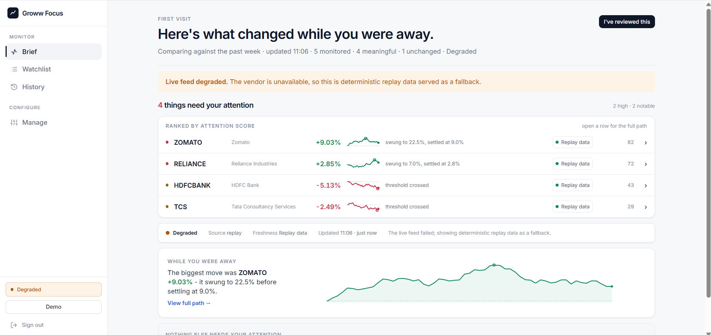

# Groww Focus

An independent hackathon project that helps you see what changed in your watchlist while you were away.

## What it does

A normal watchlist gives every stock the same visual weight. When you come back, you have to scan the whole list and remember where you left off.

Groww Focus uses your last review as a checkpoint and builds a short brief around what changed after that point. It looks at the whole price path within that window, not just the start and end, so a stock that jumped and then settled back is still surfaced. Each surfaced move gets a plain-language reason: a threshold crossed, a move that is unusual for that symbol's own volatility, a volume anomaly, or a swing within the window.



## Core workflow

1. Create an account. A starter watchlist is added automatically.
2. Add or reorder symbols and set priorities.
3. Set your sensitivity preferences in **Manage**.
4. Open **Brief** to see what changed since your last review.
5. Open an event to inspect the full price path.
6. Click **I've reviewed this** when you're done. This sets the checkpoint the next brief compares against.
7. Use **History** to see what earlier briefs surfaced.

## Live, Replay, and Degraded

**Replay**
Deterministic market data for demos and tests. The same seed produces the same series.

**Live**
Uses Twelve Data for live NSE quotes.

**Degraded**
If the live provider fails, the app falls back to replay data and clearly shows that the source changed. The UI never labels replay data as live.

Replay is a status, not a button. **Demo** is a separate action, available in the app, that seeds a populated replay scenario so the brief has something to show immediately instead of starting empty.

## Local setup

### Requirements

Docker, Python 3.11+, Node 20+

### Database

```bash
docker compose up -d db
```

### Backend

```bash
cd backend
python -m venv .venv
.venv\Scripts\activate      # macOS/Linux: source .venv/bin/activate
pip install -r requirements-dev.txt
cp .env.example .env
uvicorn app.main:app --reload
```

The API is now at http://localhost:8000.

### Frontend

```bash
cd frontend
npm install
npm run dev
```

Open http://localhost:5173, create an account, and click **Demo** in the sidebar to seed a populated brief. Without Demo, a fresh account starts on replay data with nothing surfaced yet, since there is no prior checkpoint to compare against.

## Tests

```bash
# backend unit and integration tests
cd backend && pytest

# frontend build and lint
cd frontend && npm run build && npm run lint

# end-to-end (run from the repo root, with both servers above running)
npx playwright test
```

## Deployed demo

https://groww-focus.vercel.app

## Repository

https://github.com/Zahraaabidha/Smart-Market-Watchlist

Engineering decisions are documented in [docs/decisions.md](docs/decisions.md).
